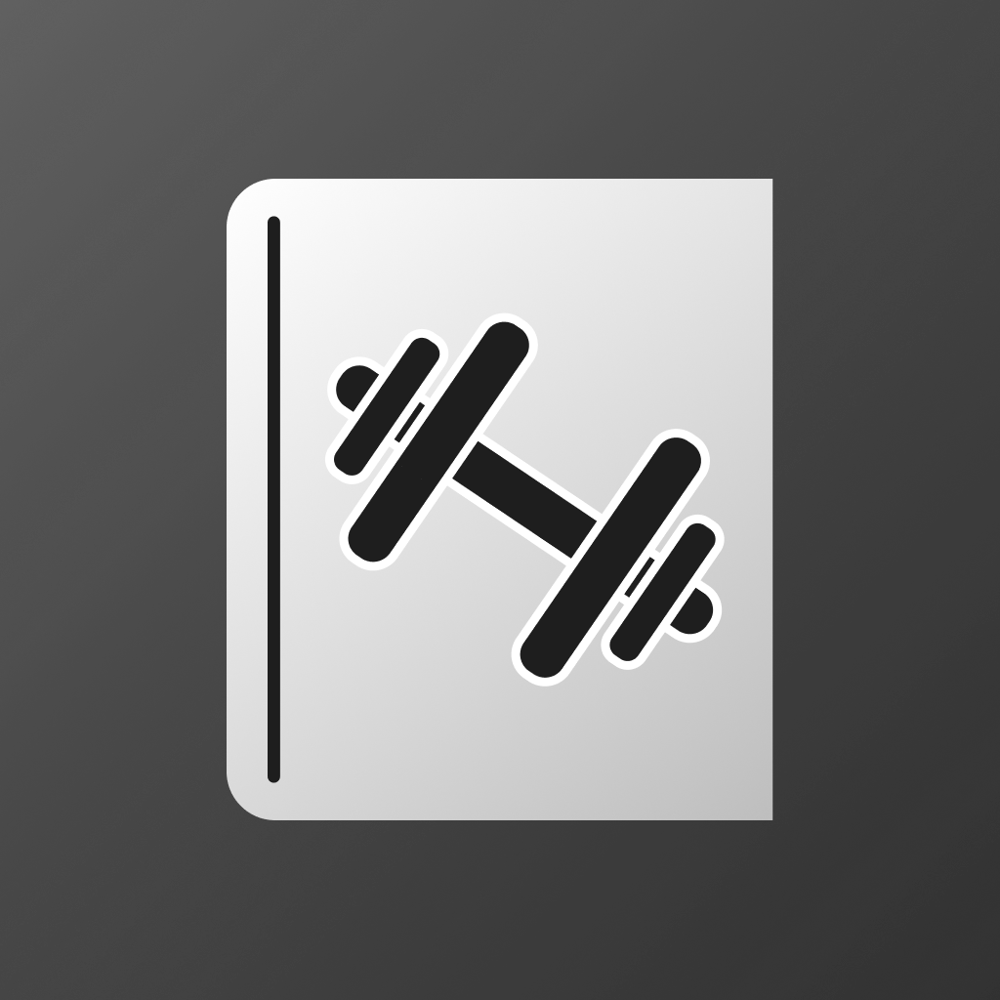
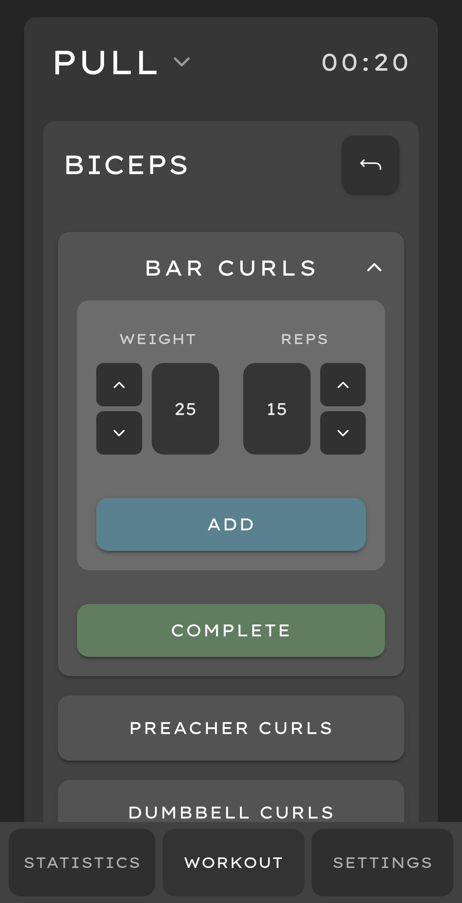
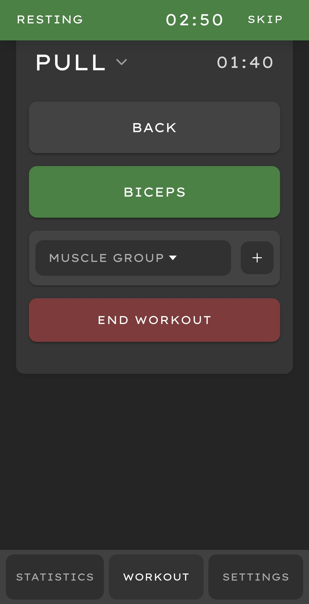
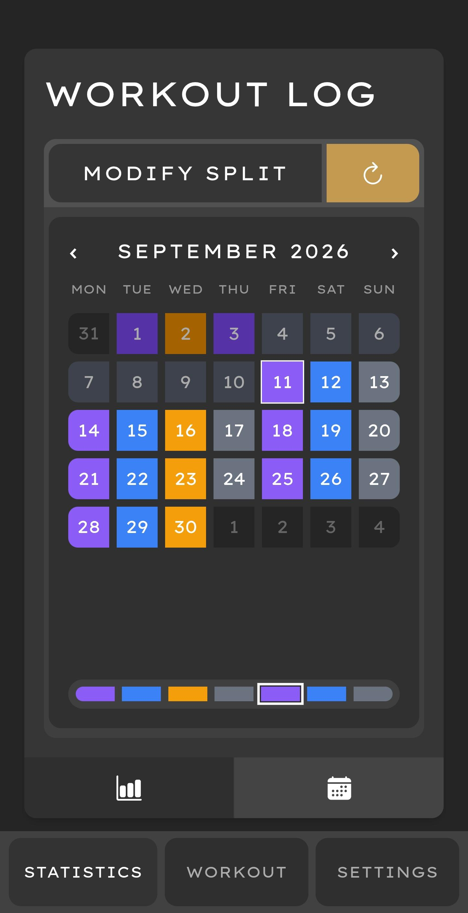

<h1>
  
  Gym Log
</h1>
<p align="left">
  
  
  
  
  
  
  
</p>
A workout tracking app built with Ionic, Angular, and Capacitor, packaged as a native Android app. Gym Log lets you build workout templates, log sets in real time, and track progress over time — fully offline, with local data persistence.

## Features

- **Workout templates** — build reusable templates organized by muscle group and exercise
- **Live workout tracking** — log sets with quick +/- steppers, auto-filled from your last session
- **Rest timer** — configurable countdown after each set, with native Android notifications (sound, vibration, and system notification channels) that work even when the app is in the background
- **Progression charts** — SVG-based charts tracking personal records per exercise over time
- **Workout log calendar** — color-coded calendar view of past workouts and upcoming planned sessions
- **Training cycles** — define a repeating workout pattern (e.g. Push/Pull/Legs/Rest) that the app tracks automatically, with manual resync support
- **Crash recovery** — an in-progress workout is auto-saved and can be resumed if the app is closed or the phone restarts
- **Local backup & restore** — export/import all data as a single file, and share it via any app (Drive, email, etc.)
- **Customizable preferences** — rest duration, and alert settings

## Tech Stack

- **Framework:** Ionic 8 + Angular 20 (standalone components)
- **Language:** TypeScript
- **Native runtime:** Capacitor 8 (Android)
- **Styling:** Tailwind CSS v4
- **Local database:** SQLite 
- **Native plugins:** Local Notifications, Haptics, Filesystem, Share, Preferences, Status Bar, Edge-to-Edge

## Screenshots

<p align="center">
  
  
  
</p>

## Getting Started

### Prerequisites

- Node.js and npm
- Ionic CLI
- Android Studio (for building/running the Android app)

### Installation

```bash
git clone https://github.com/RomanCatalin/gym-log.git
cd gym-log
npm install --legacy-peer-deps
```

### Running in the browser (dev mode)

```bash
ionic serve
```

### Running on Android

```bash
npx cap sync android
npx ionic cap run android
```

## Roadmap / Planned Features

- [ ] **Dark / Light Mode Toggle** — Dynamic theme switching based on user preference
- [ ] **Insights and Recommended Workout** - Recommandations to help user hit muscle groups efficiently
- [ ] **Revamping Progression Chart** - A more customizable and modern version
- [ ] **IOS Testing and Compatibility**
- [ ] **More UI consistency and layout Tweaks**
